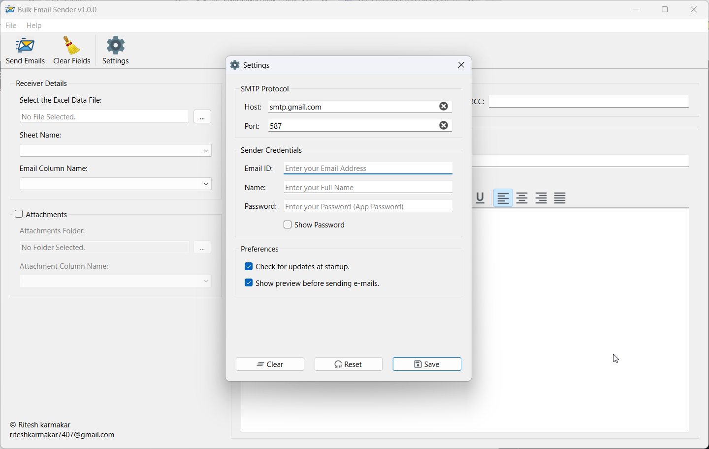
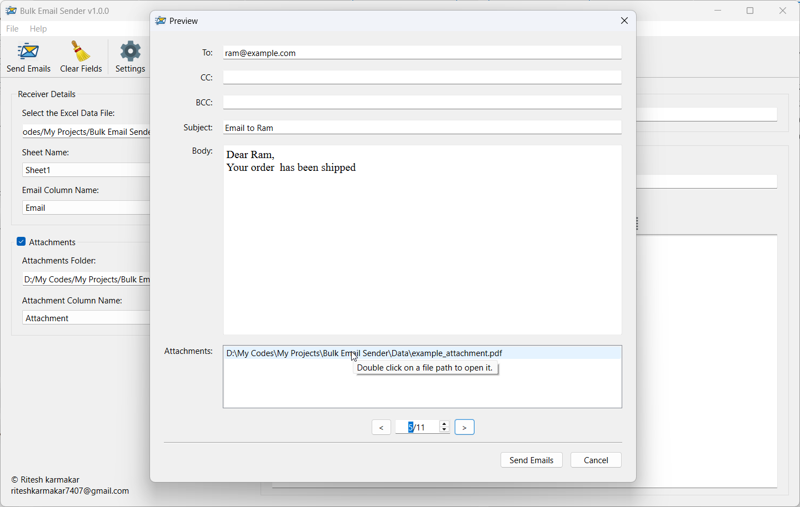

<b>Bulk Email sender</b> is a PySide6-based application designed to send personalized emails in bulk. The application supports dynamic placeholders, attachment handling, and preview functionality to streamline your email campaigns.


## Features

1. **Send Emails in Bulk**: Send multiple emails using data from an Excel or CSV file.
2. **Placeholders for Personalization**: Use `{{ }}` to dynamically replace text with values from your Excel file.
    - Example:
      ```
      Dear {{name}},
      Your order #{{order_id}} has been shipped.
      ```
      will render as:
      ```
      Dear Ram,
      Your order #12345 has been shipped.
      ```
3. **Attachment Support**: Include attachments from a folder with dynamic mapping using column names. If relative paths are used, the attachment folder must be selected. If absolute paths are provided, folder selection is not needed.
4. **Preview Dialog**: Review each email before sending.
5. **Progress Dialog**: Track the email-sending progress in real-time.
6. **Settings Dialog**: Configure SMTP host, port, sender name, email, and app password.


## Prerequisites

- Python 3.9 or higher.
- Required Python packages (listed in `requirements.txt`).

## Setup Instructions

1. Clone the repository:
    ```
    git clone https://github.com/riteshkarmakar/bulk-email-sender.git
    cd bulk-email-sender
    ```

2. Install dependencies:
    ```
    pip install -r requirements.txt
    ```

3. Run the application:
    ```
    cd src
    python main.pyw
    ```


## How to Use

1. Select an Excel file containing recipient details.
2. Enter the sheet name and email column name.
3. Optionally, enable attachments and configure the folder and column name for files.
4. Compose your email by specifying the subject and body. Use placeholders for personalization.
5. Click **Send Emails**.
    - The **Preview Dialog** will open. Confirm the emails.
    - Once confirmed, the **Progress Dialog** will display the sending status.
6. Configure SMTP settings via the **Settings** menu.
    - **Note**: The app requires an app password instead of your regular email password. Follow [this guide](https://knowledge.workspace.google.com/kb/how-to-create-app-passwords-000009237) to set up an app password.


## Potential Issues

### Windows Defender False Flagging
This application may be flagged as a virus by Windows Defender due to its email-sending capabilities. To exclude the app from being flagged:

1. Open Windows Security.
2. Navigate to **Virus & threat protection**.
3. Click **Manage settings** under **Virus & threat protection settings**.
4. Scroll down and click **Add or remove exclusions** under **Exclusions**.
5. Click **Add an exclusion**, then select **Folder** and choose the folder:

   `C:\Users\<your-username>\AppData\Local\Programs\Bulk Email Sender`

   Replace `<your-username>` with your actual Windows username.

## Screenshots

### Settings Dialog


### Preview Dialog


### Progress Dialog

---

## Credits

- **Developer**: Ritesh Karmakar
- **External Libraries/Tools Used**:
  - [PySide6](https://pypi.org/project/PySide6/)
  - [pandas](https://pypi.org/project/pandas/)
  - [requests](https://pypi.org/project/requests/)
- **Application icon** <a href="https://www.flaticon.com/free-icons/send" title="send icons">Send icons created by Prosymbols - Flaticon</a>

## License
This project is licensed under the **Personal Use and Contribution License (PUCL) v1.0.**

- Personal use is free.
- Modifications must be made via pull requests to the original repository.
- Commercial use requires a paid license.

See the full license [here](https://github.com/riteshkarmakar/bulk-email-sender/blob/master/LICENSE).

## Feedback and Support
If you encounter any issues or have feature suggestions, please reach out via riteshkarmakar7407@gmail.com.

---

**Happy Emailing!**